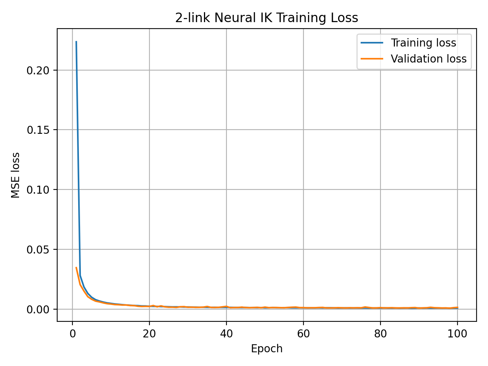
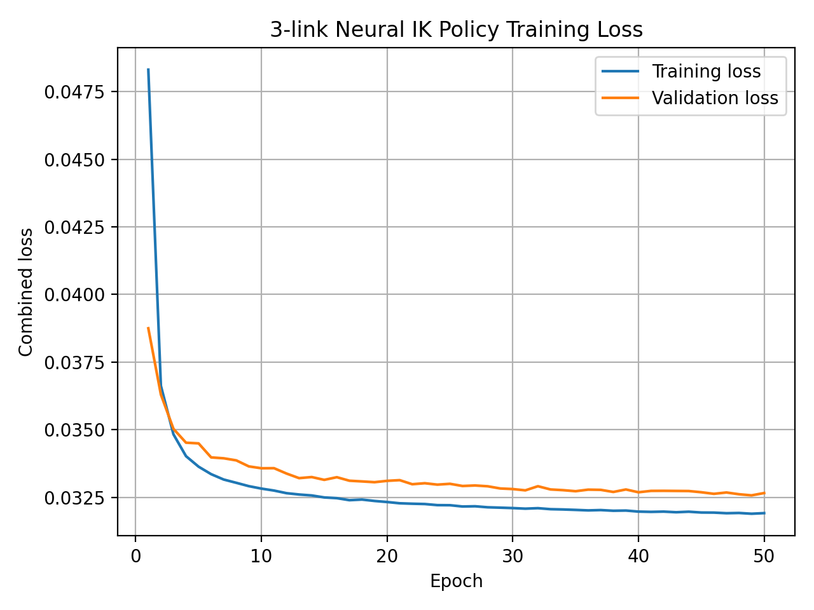
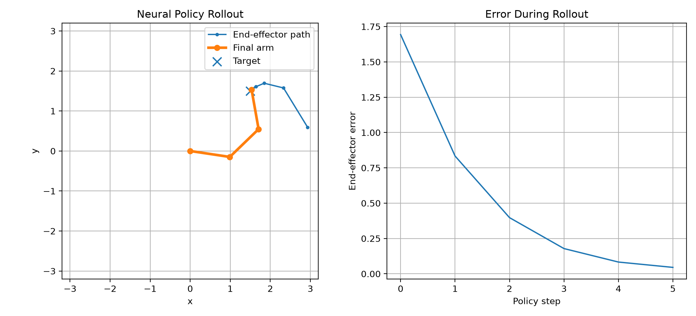

# Simulated Robot Arm - Analytical, Numerical, and Neural IK

## Why I started this project

I started this project because I was interested in neural networks and wanted a good excuse to properly learn how they work. Since I study cybernetics and robotics, inverse kinematics felt like a useful problem where I could combine robotics, mathematics, programming, and machine learning.

I did not want to begin by training a network without understanding the problem it was solving. I therefore built the project step by step. I first implemented forward kinematics, then analytical and numerical inverse kinematics, and only then started using neural networks.

The goal was never to prove that neural networks are always better. I wanted to compare them with normal robotics methods and understand both their advantages and their weaknesses.

## Final results

### 2-link arm

The comparison uses 1,000 test targets. The neural network processes all 1,000 targets in one batch, so its time represents batch throughput and not the delay of one individual request.

| Method | Mean EE error | Median error | Max error | Mean time per target |
|---|---:|---:|---:|---:|
| Analytical IK | 0.00000000 | 0.00000000 | 0.00000000 | 0.065675 ms |
| Numerical IK | 0.00000720 | 0.00000695 | 0.00001000 | 1.512989 ms |
| Neural IK | 0.02368196 | 0.01765885 | 0.14164296 | **0.001132 ms** |

The results were mostly what I expected. Analytical IK was exact, while numerical IK was extremely accurate but needed several iterations. The neural network was much less accurate, but very fast when many targets were processed together.

### 3-link arm

This comparison uses 1,000 new random targets and starting angles. Every solver gets the same problems, a tolerance of `0.05`, and a maximum of 100 steps. The timing is for solving one complete IK problem at a time on CPU.

| Method | Success | Mean error | Median error | Max error | Mean steps | Mean solve time |
|---|---:|---:|---:|---:|---:|---:|
| Pseudoinverse IK | 100.0% | 0.035788 | 0.035129 | 0.049971 | 6.85 | 0.81 ms |
| DLS IK | 100.0% | 0.036583 | 0.035838 | 0.049914 | 6.89 | **0.54 ms** |
| Neural policy | 95.9% | 0.039970 | 0.041381 | 0.094050 | 12.73 | 6.15 ms |

The neural policy became quite accurate, but the classical solvers were still faster and more reliable. This also made sense after looking at the implementation. The neural policy must run the network repeatedly, while the numerical solvers only perform a few small matrix calculations.


## Development process

### Phase 0 - Setup

I separated the project into folders for the robot arms, solvers, neural models, training, experiments, tests, data, results, and visualization. Generated datasets stay out of Git, while the final trained weights are published with the project so the results can be reproduced without retraining.

### Phase 1 - 2-link forward kinematics

Forward kinematics calculates the end-effector position when the joint angles are already known.

For a 2-link arm:

$$ x = L_1\cos(\theta_1) + L_2\cos(\theta_1 + \theta_2) $$

$$ y = L_1\sin(\theta_1) + L_2\sin(\theta_1 + \theta_2) $$

An important point for me was understanding that the second link angle is cumulative. Its global angle is $\theta_1 + \theta_2$, not only $\theta_2$.

I also made static plots, an animation, and tests. Forward kinematics later became the main way to check whether an IK solution was actually correct.

### Phase 2 - 2-link analytical IK

Analytical IK does the opposite: the target position is known, and the goal is to calculate the angles directly.

I used the law of cosines to find $\theta_2$:

$$ \cos(\theta_2) = \frac{x^2 + y^2 - L_1^2 - L_2^2}{2L_1L_2} $$

I then used the direction to the target and the triangle between the two links to find $\theta_1$:

$$ \theta_1 = \mathrm{atan2}(y, x) - \mathrm{atan2}\left(L_2\sin(\theta_2), L_1 + L_2\cos(\theta_2)\right) $$

Changing the sign of $\theta_2$ gives the other elbow configuration. The implementation checks whether the target can be reached and returns both elbow-up and elbow-down solutions.

This method is exact and fast, but the derivation depends on the arm geometry. More complicated robots do not always have a simple analytical solution.

### Phase 3 - 2-link numerical IK

The numerical solver was my introduction to using the Jacobian for IK. The basic relationship is:

$$ \Delta \mathbf{p} = J\Delta\boldsymbol{\theta} $$

The Jacobian contains the partial derivatives of the end-effector coordinates with respect to the joint angles:

$$ J = \begin{bmatrix} \dfrac{\partial x}{\partial \theta_1} & \dfrac{\partial x}{\partial \theta_2} \\ \dfrac{\partial y}{\partial \theta_1} & \dfrac{\partial y}{\partial \theta_2} \end{bmatrix} $$

Since I know the desired Cartesian error, I use the pseudoinverse to calculate a joint correction:

$$ \mathbf{e} = \mathbf{p}_{\mathrm{target}} - \mathbf{p}_{\mathrm{current}} $$

$$ \Delta\boldsymbol{\theta} = J^+\mathbf{e} $$

$$ \boldsymbol{\theta}_{\mathrm{next}} = \boldsymbol{\theta} + \alpha\Delta\boldsymbol{\theta} $$

Here, $\alpha$ is the learning rate. It makes each update smaller and helps avoid overshooting. The solver repeats this process until the error is small enough or the maximum number of iterations is reached.

Unlike analytical IK, the numerical method is approximate and depends on the initial guess. I understood it as something similar to a proportional controller: measure the error, calculate a correction, and repeat.

### Phase 4 - 2-link neural IK

The first neural network was mainly a sanity check. It learned the mapping:

$$ (x_{\mathrm{target}}, y_{\mathrm{target}}) \longrightarrow (\theta_1, \theta_2) $$

One problem is that the same target can have more than one correct IK solution. To avoid giving the network contradictory answers, I restricted the generated angles to one branch:

$$ \theta_1 \in [-\pi/2, \pi/2], \qquad \theta_2 \in [0, \pi] $$

The network architecture was `2 -> 64 -> 64 -> 2`. I used this part of the project to learn about linear layers, ReLU, mean squared error, backpropagation, and the Adam optimizer.

The network was trained on 50,000 examples. Training and validation loss stayed close, so there was no clear sign of overfitting. Still, low angle loss was not enough by itself. I also checked the actual end-effector error after applying the predicted angles.



### Phase 5 - 3-link forward kinematics

The 3-link arm uses the same idea as the 2-link arm, but with one more cumulative angle:

$$ x = L_1\cos(\theta_1) + L_2\cos(\theta_1+\theta_2) + L_3\cos(\theta_1+\theta_2+\theta_3) $$

$$ y = L_1\sin(\theta_1) + L_2\sin(\theta_1+\theta_2) + L_3\sin(\theta_1+\theta_2+\theta_3) $$

This geometry was tested before moving on to the 3-link solvers.

### Phase 6 - 3-link numerical IK

The end effector still moves in 2D, but there are now three joint angles. The Jacobian therefore has shape $2 \times 3$. This means the arm is redundant: several different angle combinations can reach the same target.

The pseudoinverse update is still:

$$ \Delta\boldsymbol{\theta} = J^+\mathbf{e} $$

The pseudoinverse can give very large updates near singular configurations. To make the solver more stable, I also implemented damped least squares (DLS):

$$ \Delta\boldsymbol{\theta} = J^T\left(JJ^T + \lambda^2 I\right)^{-1}\mathbf{e} $$

The damping value $\lambda$ controls the tradeoff. A small value behaves more like the pseudoinverse, while a larger value reduces large updates but may make the solver slower or less precise.

DLS was chosen as the teacher for the neural policy because it behaved more reliably near difficult configurations.

### Phase 7 - Dataset for the 3-link neural policy

For the redundant 3-link arm, this direct mapping is ambiguous:

$$ (x_{\mathrm{target}}, y_{\mathrm{target}}) \longrightarrow (\theta_1, \theta_2, \theta_3) $$

There can be many correct output angles for one target. Instead, I trained the network to predict one movement from the current state:

$$ (x_{\mathrm{target}}, y_{\mathrm{target}}, \theta_1, \theta_2, \theta_3) \longrightarrow (\Delta\theta_1, \Delta\theta_2, \Delta\theta_3) $$

The network is therefore one-shot for each movement, but not one-shot for the complete IK problem. During rollout, the prediction is applied repeatedly.

The final dataset contains 200,000 samples:

- 160,000 training samples from complete DLS trajectories.
- 20,000 validation samples from separately generated trajectories.
- 20,000 test samples where every row starts a new random IK problem.

The splits are generated separately so that neighboring states from the same trajectory cannot appear in both training and testing. DLS and neural updates are also limited to a joint-step norm of `0.5` to avoid very large movements.

### Phase 8 - Training and improving the 3-link policy

#### First attempt

The first policy used raw target coordinates and raw joint angles with a `5 -> 128 -> 128 -> 3` network.

It learned useful individual movements, but complete rollout was bad:

| Metric | First policy |
|---|---:|
| Success rate | 13.2% |
| Mean final error | 0.4415 |
| Mean rollout steps | 89.51 |

I expected repeated predictions to behave similarly to the DLS solver. Instead, small prediction mistakes accumulated. The network eventually reached states that were not well represented by the original isolated training samples.

#### Improved policy

The main improvement was changing what the network learned from, not only making it larger.

The original five inputs are converted inside the model into:

$$ \left[ \begin{array}{cccccccc} \dfrac{e_x}{6} & \dfrac{e_y}{6} & \sin\theta_1 & \cos\theta_1 & \sin\theta_2 & \cos\theta_2 & \sin\theta_3 & \cos\theta_3 \end{array} \right] $$

Cartesian error tells the network which direction the arm still needs to move. Sine and cosine avoid the numerical jump between $-\pi$ and $\pi$.

The final network is `8 -> 256 -> 256 -> 256 -> 3`. It uses a combined loss:

$$ \mathcal{L}_{\mathrm{total}} = \mathcal{L}_{\mathrm{DLS}} + 0.1\mathcal{L}_{\mathrm{EE}} $$

The first term teaches the network to copy the DLS update. The second term checks whether the predicted update actually moves the end effector in a useful direction.

The model was trained for 50 epochs with a batch size of 512. The final result was 95.9% success and a mean final error of 0.0400.

An earlier evaluation gave 99.4% success, but this result was not valid. Steps from the same trajectory had leaked into both training and testing, and many test states were already close to the target. I regenerated the splits separately and used fresh random starts for the final comparison.





### Phase 9 - Final comparison

The final experiment follows the same basic structure as the earlier 2-link comparison. It loads test inputs, gives every solver the same targets and starting angles, records the errors and times, and prints a summary over 1,000 samples.

The main conclusion is that the neural policy now works well, but the classical methods are still better for this small problem. Neural inference becomes especially fast when many independent inputs are processed as a batch, as shown by the 2-link experiment. The 3-link policy is iterative, so it does not get the same speed advantage in the current implementation.

### Phase 10 - Visualization and documentation

The final stage was to make the results understandable without only looking at printed numbers. The project includes loss plots, a rollout error plot, and a side-by-side GIF where pseudoinverse IK, DLS, and the neural policy solve two different problems in sequence.

The implementation currently has 20 tests.

## Handwritten notes

The notes I made while learning the methods are included in `notes/`:

- [Analytical 2-link IK](<notes/Analytical 2 Link.pdf>)
- [Numerical 2-link IK](<notes/Numerical Solver 2 Link.pdf>)
- [2-link neural IK](<notes/NN IK 2 Link.pdf>)
- [Numerical 3-link IK and DLS](<notes/Numerical IK 3 Link.pdf>)
- [3-link neural IK](<notes/NN IK 3 Link.pdf>)

## Project structure

```text
arms/           Forward kinematics and arm geometry
data/           Dataset generation and splitting
experiments/    Demonstrations, plots, and comparisons
models/         PyTorch neural networks
notes/          Handwritten derivations and explanations
results/        Saved plots, GIFs, and comparison tables
solvers/        Analytical, numerical, DLS, and neural IK
tests/          Tests for geometry, solvers, data, and training
training/       Shared training code and entry points
visualization/  Plotting and animation helpers
```

## Running the project

The tested environment is Python 3.12.13 with NumPy 2.5.1, Matplotlib 3.11.0, Pillow 12.3.0, PyTorch 2.13.0 (CPU), and pytest 9.1.1. These exact direct dependency versions are pinned in `requirements.txt`.

```powershell
python -m venv .venv
.venv\Scripts\Activate.ps1
python -m pip install -r requirements.txt
python -m pytest
```

Run the final 2-link and 3-link benchmarks with one command:

```powershell
python -m experiments.run_final_benchmarks
```

This uses the published weights and deterministic benchmark cases when the generated datasets are not present. It also regenerates the two-example solver GIF.

## Published trained weights

The final weights are included under `models/saved/`, so training is optional:

| Model | File | SHA-256 |
|---|---|---|
| 2-link neural IK | `models/saved/neural_ik_2link.pt` | `cf4577d7d152a02f95cb41e38f4f192df413cded84ffc5f444f15833c98c343b` |
| 3-link neural policy | `models/saved/neural_ik_3link.pt` | `11a9d6fa808f47eb6430cb2516103230945b3127e887896bc21a40be7ad496ec` |

To reproduce the training itself, run the dataset-generation and training commands below.

Run the 2-link neural experiment:

```powershell
python -m experiments.phase4_generate_dataset
python -m training.train_neural_ik_2link
python -m experiments.phase4_plot_losses
python -m experiments.phase4_compare_ik_methods
```

Run the 3-link neural-policy experiment:

```powershell
python -m experiments.phase7_generate_dataset_3link
python -m training.train_neural_ik_3link
python -m experiments.phase8_plot_losses
python -m experiments.phase8_evaluate_neural_policy
```

The generated datasets are intentionally not included in Git. The final trained weights are included.

## Scope and limitations

This is an educational simulation, not a controller for a physical robot.

- The links are zero-thickness lines.
- Joints are treated as continuous and angles are wrapped to $[-\pi, \pi]$.
- Joint limits, self-collision, obstacles, torque, acceleration, and dynamics are not included.
- The 3-link neural policy is trained for unit link lengths and the sampled workspace.
- Timing depends on the computer and implementation.
- NumPy and PyTorch perform their main numerical calculations in compiled code, while Python controls the experiment.
- The 2-link neural timing measures batch throughput. The 3-link timing measures the time for one complete sequential solve.

Collision-free movement would require robot geometry, collision checking between each pose, and a teacher or planner that understands these constraints. I consider that a separate motion-planning problem rather than part of this IK comparison.

## What I learned

- Forward kinematics is needed to verify every IK result.
- Analytical IK is exact and fast, but depends on the robot geometry.
- Numerical IK is iterative and depends on the starting angles.
- DLS is more stable near difficult or singular configurations.
- Redundancy makes direct supervised IK outputs ambiguous.
- Low one-step neural loss does not guarantee a successful rollout.
- Training data should include the states the policy will actually visit.
- Better inputs and a useful loss function mattered more than only increasing the network size.
- Incorrect dataset splitting can make a model look better than it really is.
- The neural policy became useful, but the classical methods are still the best choice for this small IK problem.

## Documentation note

I used conversations with GPT-5.5 throughout the project to question my ideas and organize what I learned. The implementation, experiments, handwritten derivations, and conclusions are my own work. GPT-5.6 Sol generated the final README from this material.
