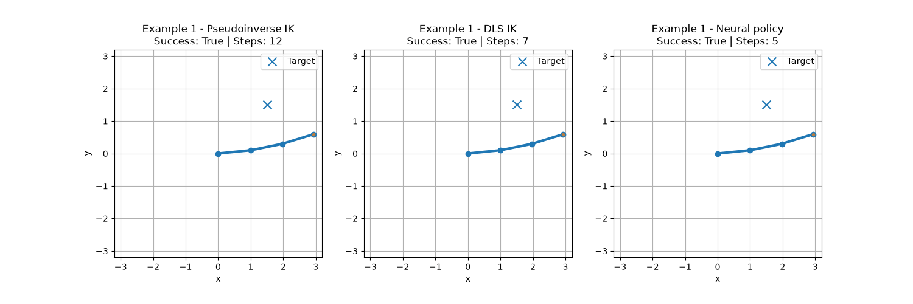

# Simulated Robot Arm: Analytical, Numerical, and Neural Inverse Kinematics

This project is a from-scratch study of inverse kinematics (IK) for planar 2-link and 3-link robot arms. I built it in phases so every new method had a simpler baseline to compare against: forward kinematics, exact analytical IK, iterative Jacobian IK, and finally learned neural IK.

The goal is not to claim that neural networks are always better. The goal is to understand when a learned policy can approximate a classical IK controller, where it fails, and what changes make it reliable.

## Final results

### 2-link IK

The 2-link comparison uses 1,000 test targets. Neural inference is performed as one batch, so its timing represents throughput rather than single-request latency.

| Method | Mean EE error | Median error | Max error | Mean compute time per target |
|---|---:|---:|---:|---:|
| Analytical IK | 0.00000000 | 0.00000000 | 0.00000000 | 0.065675 ms |
| Numerical IK | 0.00000720 | 0.00000695 | 0.00001000 | 1.512989 ms |
| Neural IK | 0.02368196 | 0.01765885 | 0.14164296 | **0.001132 ms** |

Analytical IK is exact and numerical IK is extremely accurate. The restricted neural model is less accurate, but demonstrates the throughput advantage of batched inference.

### 3-link IK

The 3-link comparison uses 1,000 fresh random targets and starting poses. Every method receives the same problems, a tolerance of `0.05`, and a maximum of 100 steps. Timing measures one complete solve at a time on CPU.

| Method | Success | Mean error | Median error | Max error | Mean steps | Mean solve time |
|---|---:|---:|---:|---:|---:|---:|
| Pseudoinverse IK | 100.0% | 0.035788 | 0.035129 | 0.049971 | 6.85 | 0.81 ms |
| DLS IK | 100.0% | 0.036583 | 0.035838 | 0.049914 | 6.89 | **0.54 ms** |
| Neural policy | 95.9% | 0.039970 | 0.041381 | 0.094050 | 12.73 | 6.15 ms |

The neural policy became competitive in success and error, but did not beat the classical methods. Its rollout needs more steps and repeated small PyTorch calls, so it is slower for this small single-target problem.



## Phase-by-phase development

### Phase 0 - Setup

The repository was separated into arms, solvers, models, training, experiments, visualization, tests, data, and results. Generated datasets and model weights are ignored by Git, while small benchmark and visualization artifacts are kept.

### Phase 1 - 2-link forward kinematics

Forward kinematics answers: given the joint angles, where are the joints and end effector?

```text
x = L1 cos(theta1) + L2 cos(theta1 + theta2)
y = L1 sin(theta1) + L2 sin(theta1 + theta2)
```

The second link uses the cumulative angle `theta1 + theta2`. Static plotting, animation, and tests were added before attempting inverse kinematics.

### Phase 2 - 2-link analytical IK

Analytical IK reverses the mapping: given `(x, y)`, calculate the angles directly. I derived `theta2` with the law of cosines, then derived `theta1` from the target direction and the triangle formed by the links.

The implementation handles reachability, elbow-up and elbow-down branches, the folded special case, and verification through forward kinematics. This became the exact baseline, although a convenient closed-form solution does not generalize to every robot geometry.

### Phase 3 - 2-link numerical IK

The numerical solver uses the Jacobian:

```text
delta_position = J * delta_theta
```

The Jacobian describes how small joint changes affect the end effector. Because the desired Cartesian error is known, the update is approximated with the Moore-Penrose pseudoinverse:

```text
error = target_position - current_position
delta_theta = J_pinv * error
theta = theta + learning_rate * delta_theta
```

The learning rate reduces overshoot, and angles are wrapped to `[-pi, pi]`. Unlike analytical IK, this method is approximate, iterative, and dependent on the initial guess. It behaves like a proportional feedback controller: observe the remaining error, apply a correction, and repeat.

### Phase 4 - 2-link neural IK sanity check

The first neural model learns:

```text
[target_x, target_y] -> [theta1, theta2]
```

IK can have multiple correct angle solutions, which makes supervised labels ambiguous. I restricted the generated configurations to one consistent branch:

```text
theta1 in [-pi/2, pi/2]
theta2 in [0, pi]
```

The network is `2 -> 64 -> 64 -> 2`. The handwritten notes follow the full training logic: affine layers, ReLU, mean squared error, backpropagation, and parameter updates. It was trained with Adam and MSE on 50,000 examples split into training, validation, and test data.

Training and validation loss stayed close, so there was no strong evidence of overfitting. Angle MSE was not treated as the final metric; predicted angles were evaluated by their resulting end-effector error.


### Phase 5 - 3-link forward kinematics

The third link adds another cumulative angle:

```text
link 1 angle = theta1
link 2 angle = theta1 + theta2
link 3 angle = theta1 + theta2 + theta3
```

This established and tested the geometry used by every later 3-link solver.

### Phase 6 - 3-link numerical IK

The task still controls a 2D position, but there are now three joints. The Jacobian is `2 x 3`, which makes the arm redundant: many configurations can reach the same target.

The pseudoinverse chooses one local update, but can generate large corrections near singular or poorly conditioned configurations. I therefore added damped least squares (DLS), related to the Levenberg-Marquardt method:

```text
delta_theta = J.T * inverse(J * J.T + lambda^2 * I) * error
```

The damping value trades some aggressiveness for stability. A small value resembles the pseudoinverse; a larger value suppresses extreme updates but can slow convergence. DLS became the neural policy's teacher because it was the more stable classical controller.

### Phase 7 - 3-link policy dataset

A direct mapping is inappropriate for a redundant arm:

```text
[target_x, target_y] -> [theta1, theta2, theta3]
```

The same target can have many correct angle vectors, creating contradictory labels. Instead, the network learns a local controller:

```text
[target_x, target_y, current_theta1, current_theta2, current_theta3]
    -> [delta_theta1, delta_theta2, delta_theta3]
```

One neural call predicts one movement, not a complete IK solution. During rollout, predictions are repeatedly applied until the target tolerance or step limit is reached.

The final dataset contains 200,000 samples:

- 160,000 training samples from complete DLS trajectories.
- 20,000 validation samples from separately generated trajectories.
- 20,000 test samples where every row is a fresh random target and starting pose.

The splits are generated separately so neighboring steps from one trajectory cannot leak into both training and evaluation. DLS and neural updates are capped at a joint-step norm of `0.5` for stability.

### Phase 8 - 3-link neural policy and rollout

#### First attempt

The first policy used raw target coordinates and raw angles with a `5 -> 128 -> 128 -> 3` network. It imitated individual DLS steps reasonably well, but complete rollout was poor:

| Metric | First policy |
|---|---:|
| Success rate | 13.2% |
| Mean final error | 0.4415 |
| Mean rollout steps | 89.51 |

This was the most important negative result. Good one-step imitation did not guarantee a good closed-loop controller. Prediction errors accumulated, pushing the policy into states poorly represented by isolated random samples.

#### Improved policy

The improvement came from redesigning the learning problem, not only adding neurons. The raw five-value input is converted inside the model into eight features:

```text
normalized_error_x, normalized_error_y,
sin(theta1), cos(theta1),
sin(theta2), cos(theta2),
sin(theta3), cos(theta3)
```

Cartesian error directly represents the movement still required. Sine and cosine avoid the discontinuity between `-pi` and `pi`, where nearly identical physical angles otherwise appear numerically far apart.

The final architecture is `8 -> 256 -> 256 -> 256 -> 3`. Training uses a combined objective:

```text
total loss = DLS update imitation loss
           + 0.1 * end-effector loss after the predicted update
```

The imitation term teaches the DLS correction. The task term checks what the correction physically does. Training uses Adam, a batch size of 512, and 50 epochs.

An early evaluation produced 99.4% success, but I rejected it after finding trajectory leakage: neighboring states from one trajectory had been divided between training and test data, and many test states were already close to the target. Separately generated splits and fresh test starts produced the honest final rate of 95.9%.


### Phase 9 - Final comparison

The final comparison follows the same structure as the 2-link experiment. It loads saved test inputs, gives every method the same target and starting angles, records errors and timings, and summarizes 1,000 samples.

The results support a balanced conclusion:

- Analytical IK is ideal when a closed form exists.
- Pseudoinverse and DLS are accurate and efficient general baselines.
- Neural rollout quality depends strongly on training distribution and state representation.
- Neural inference is extremely fast when independent inputs are batched, as shown by the 2-link experiment.
- A small sequential 3-link problem does not automatically benefit from neural inference because repeated single-sample calls add overhead.

### Phase 10 - Visualization and documentation

The final stage packages the work so the behavior is visible rather than represented only by numbers. The repository includes normal and logarithmic loss plots, a neural rollout path with error history, and a side-by-side GIF of pseudoinverse, DLS, and neural IK solving the same target. The complete implementation is covered by 20 tests.

## Handwritten learning notes

The `notes/` directory contains the derivations and explanations used while building the project:

- [Analytical 2-link IK](<notes/Analytical 2 Link.pdf>)
- [Numerical 2-link IK](<notes/Numerical Solver 2 Link.pdf>)
- [2-link neural IK](<notes/NN IK 2 Link.pdf>)
- [Numerical 3-link IK and DLS](<notes/Numerical IK 3 Link.pdf>)
- [3-link neural IK](<notes/NN IK 3 Link.pdf>)

## Project structure

```text
arms/           Forward kinematics and arm geometry
data/           Dataset generation and splitting
experiments/    Runnable demonstrations, plots, and comparisons
models/         PyTorch neural-network definitions
notes/          Handwritten derivations and learning notes
results/        Saved plots, GIFs, and comparison tables
solvers/        Analytical, numerical, DLS, and neural IK solvers
tests/          Kinematics, solver, dataset, and training tests
training/       Shared training utilities and entry points
visualization/  Static and animated visualization helpers
```

## Running the project

```powershell
python -m venv .venv
.venv\Scripts\Activate.ps1
python -m pip install -r requirements.txt
python -m pytest
```

Generate, train, and evaluate the 2-link model:

```powershell
python -m experiments.phase4_generate_dataset
python -m training.train_neural_ik_2link
python -m experiments.phase4_plot_losses
python -m experiments.phase4_compare_ik_methods
```

Generate, train, and evaluate the 3-link policy:

```powershell
python -m experiments.phase7_generate_dataset_3link
python -m training.train_neural_ik_3link
python -m experiments.phase8_plot_losses
python -m experiments.phase8_evaluate_neural_policy
```

Datasets and trained weights are generated locally and intentionally excluded from Git.

## Scope and limitations

This is an educational simulation and algorithm benchmark, not a production robot controller.

- Links are ideal zero-thickness line segments.
- Joints are treated as continuous and angles are wrapped to `[-pi, pi]`.
- Mechanical stops, self-collision, obstacles, torque, acceleration, and dynamics are not modeled.
- The 3-link policy is trained for unit link lengths and the sampled reachable workspace.
- Timing depends on hardware and implementation. NumPy and PyTorch execute heavy kernels in compiled native code, while Python coordinates the experiment.
- The 2-link neural timing measures batched throughput; the 3-link timing measures sequential complete-solve latency.

Collision-aware movement would require robot geometry, interpolated collision checks, and a constraint-aware teacher or planner. That is a separate motion-planning problem rather than an omitted part of this position-IK benchmark.

## Main lessons

- Forward kinematics is the foundation for verifying every IK method.
- Analytical IK is exact and fast but specific to geometry.
- Numerical IK is iterative, initialization-dependent, and broadly applicable.
- DLS trades aggressiveness for stability near singular configurations.
- Redundancy makes direct supervised IK targets ambiguous.
- One-step validation loss is insufficient for an iterative controller.
- Training data must represent states encountered during rollout.
- Better features and task-aware loss mattered more than network width alone.
- Data leakage briefly made the neural policy look better than it really was.
- The improved neural policy is credible, but classical solvers remain faster and slightly more reliable for this small problem.
